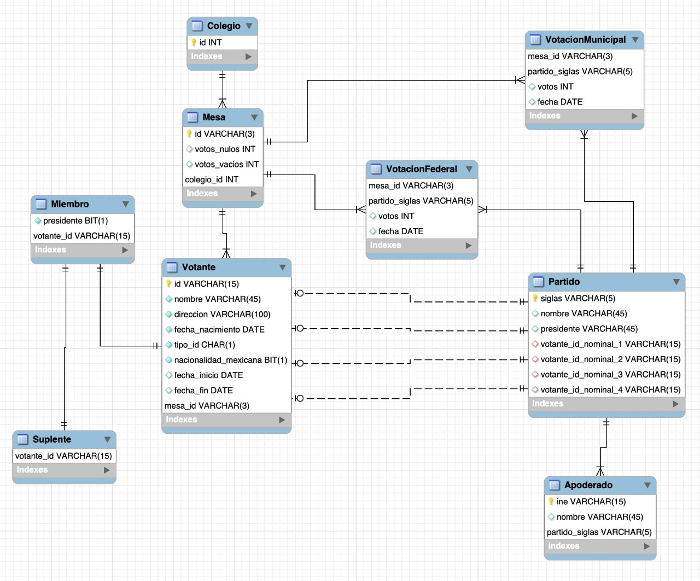

# Tarea 1. SQL Avanzado

---

##### Integrantes:
1. *[Simón Meta Grego]* - *[A01377925]* - *[Santa Fe]*
2. *[Christian Alberto Dalma Schultz]* - *[A01423166]* - *[Santa Fe]*
3. *[Jorge Damián Palacios Hristova]* - *[A01654203]* - *[Santa Fe]*
4. *[Isabel Maqueda Rolon]* - *[A01652906]* - *[Santa Fe]*

---
## 1. Aspectos generales

Las orientaciones de la tarea se encuentran disponibles en la plataforma **Canvas**.

Este documento es una guía sobre qué información debe entregar como parte de la tarea, qué requerimientos técnicos debe cumplir y la estructura que debe seguir para organizar su entrega.


### 1.1 Requerimientos técnicos

A continuación se mencionan los requerimientos técnicos mínimos de la tarea, favor de tenerlos presente para que cumpla con todos.

* El equipo tiene la libertad de elegir las tecnologías de desarrollo a utilizar en la tarea, sin embargo, debe tener presente que la solución final se deberá ejecutar en una plataforma en la nube. Puede ser  [Google Cloud Platform](https://cloud.google.com/?hl=es), [Azure](https://azure.microsoft.com/en-us/), AWS [AWS](https://aws.amazon.com/es/free/) u otra.
* El equipo tiene la libertad de utilizar el DBMS de su preferencia.
* La arquitectura de la solución deberá estar separada claramente por capas (*frontend*, *backend*, datos y almacenamiento).
* Todo el código, *scripts* y la documentación de la tarea debe alojarse en este repositorio de GitHub, siguiendo la estructura que aparece a continuación.

### 1.2 Estructura del repositorio

El proyecto debe seguir la siguiente estructura de carpetas:
```
- / 			        # Raíz de toda la tarea
    - README.md			# Archivo con la información general de la tarea (este archivo)
    - frontend			# Carpeta con la solución del frontend (Web app)
    - backend			# Carpeta con la solución del backend en caso de ser necesario (CMS o API)
    - scripts		    # Carpeta con los scripts necesarios para generar la base de datos, cargar datos y ejecutar las consultas
    - database			# Carpeta con el diagrama Entidad-Relación Extendido y los archivos CSV de datos necesarios para generar la bases de datos

```

### 1.3 Documentación de la tarea

Como parte de la entrega de la tarea, se debe incluir la siguiente información:

* Diagrama del *Modelo Entidad-Relación Extendido*.
* *Scripts* para generar la base de datos, cargar datos y ejecutar consultas.
* Archivos CSV con los datos a cargar en al base de datos.
* Guía de configuración, instalación y despliegue de la aplicación en la plataforma en la nube  seleccionada.
* El código debe estar documentado siguiendo los estándares definidos para el lenguaje de programación seleccionado.

## 2. Solución

A continuación aparecen descritos los diferentes elementos que forman parte de la solución de la tarea.

### 2.1 Modelo de la *base de datos* 


Como se puede ver en el diagrama, tenemos cuatro entidades importantes. Son Colegio, Mesa, Votante y Partido. Cada entidad tiene sus propios ids y sus propias variables. Como Votante puede ser Extranjero o mexicano, esta como entidad debil, ya que depende de la jerarquia para poder existir. Pero como se puede ver, al ser mexicano tambien tienes opciones y una jerarquia. El mexicano puede ser un miembro Presidoente ó Vocal ó puede ser un Suplente del Presidente o Vocal. Por eso la relacion es no disjuntiva y la relacion de Mexicano ó Extranjero es disjuntiva. EL Partido tambien tiene una relacion con votante, ya que cada partido tiene una lista municipal de 4 personas votantes que no son parte de alguna mesa. Aparte, cada partido guarda el nombre de su Presidente, su nombre y las siglas del partido al igual que el Apoderado del Partido.

Haciendo uso de fechas, en la relacion entre Mesa y Votante estan las fechas de inicio y fin del Presidente Suplente o Vocal de cada mesa. 

Tambien entre Mesa y Partido hay dos tablas, que representan las Votación Federal y municipal, en donde mesa pasa el número de votos que recibio cada partido sin contar votos nulos ó vacios en cada periodo de Votación. 
### 2.2 Arquitectura de la solución


### 2.3 Frontend

*[Incluya aquí una explicación de la solución utilizada para el frontend de la tarea. No olvide incluir las ligas o referencias donde se puede encontrar información de los lenguajes de programación, frameworks y librerías utilizadas.]*

#### 2.3.1 Lenguaje de programación
#### 2.3.2 Framework
#### 2.3.3 Librerías de funciones o dependencias

## 2.5 Pasos a seguir para utilizar la aplicación

Para crear la base de datos se debe de usar docker, en la carpeta de /scripts existen los comandos para crear las tablas al igual que los inserts para meter todos los datos en la base de datos de las votaciones al igual se presentan los updates y deletes para probar lod datos dentro de la bases de datos. Al igual a la hora de crear las tablas se crean las tablas versionadas. 

## 3. Referencias

https://www.ibm.com/analytics/db2
https://dev.to/sahilrajput/install-flask-and-create-your-first-web-application-2dba
https://stackoverflow.com/questions/6044326/how-to-connect-python-to-db2
